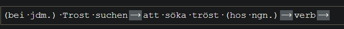

# se-learning-assistant

The dict.cc db is downloaded
The dict.cc db is build upon such lines:

A translation can be made with https://readloud.net/

Or it simply uses the unofficiel dict.cc client

https://github.com/naitian/dictcc-js

Getting the swedish phunetics: https://github.com/open-dict-data/ipa-dict/blob/master/data/sv.txt

Phunetics cheat sheet: https://upload.wikimedia.org/wikipedia/commons/8/8e/IPA_chart_2018.pdf

Another straight SV to something else translation db https://github.com/open-dict-data/wikidict-sv/blob/master/README.md

https://www.npmjs.com/package/dictcc